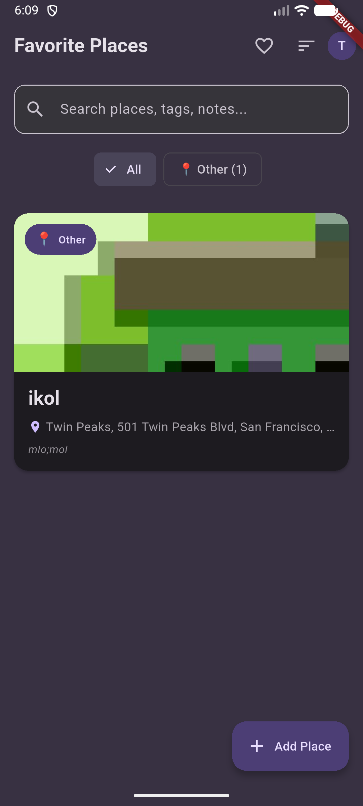
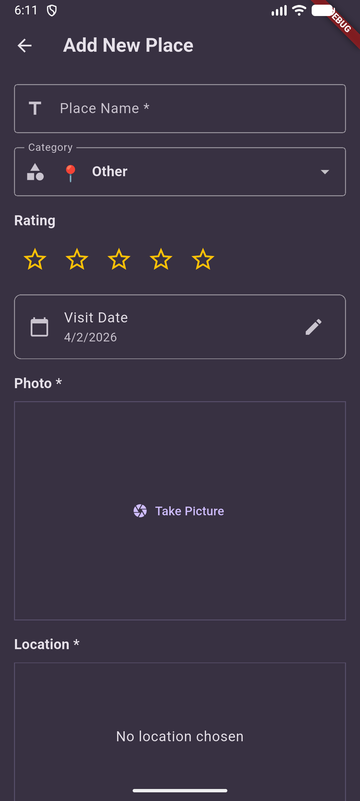
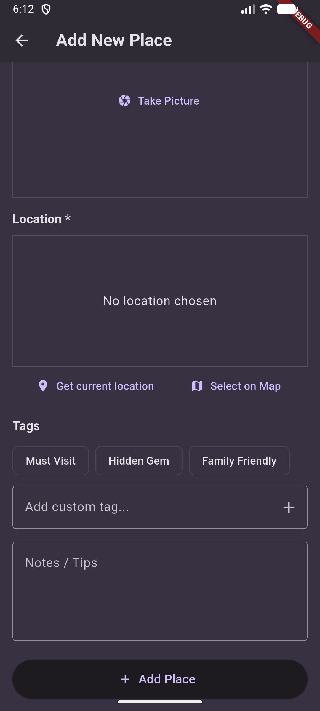
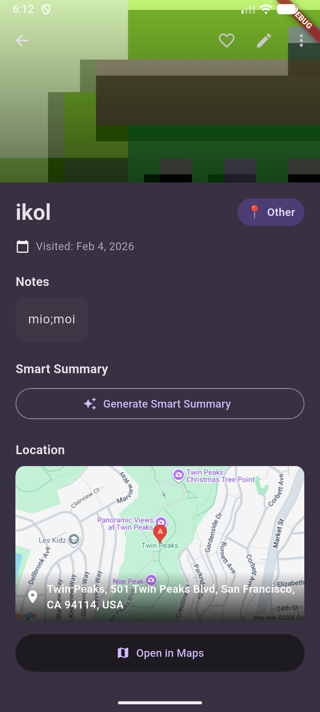
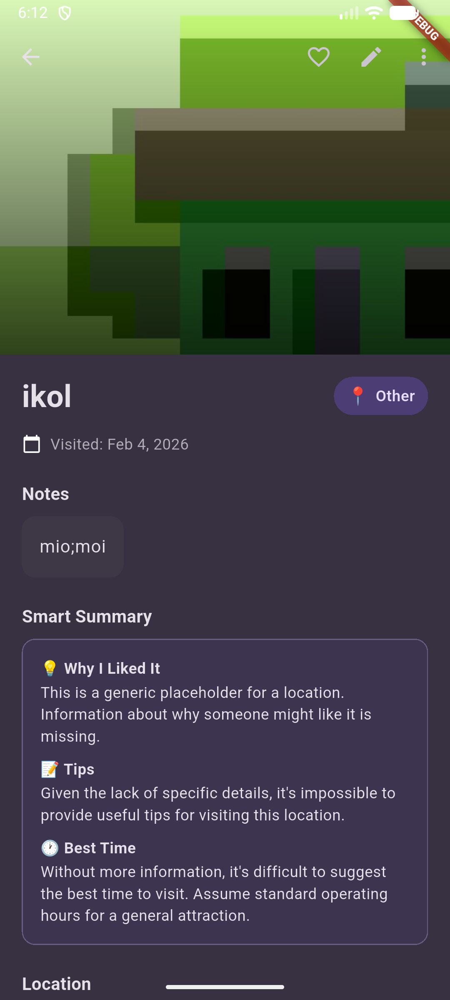
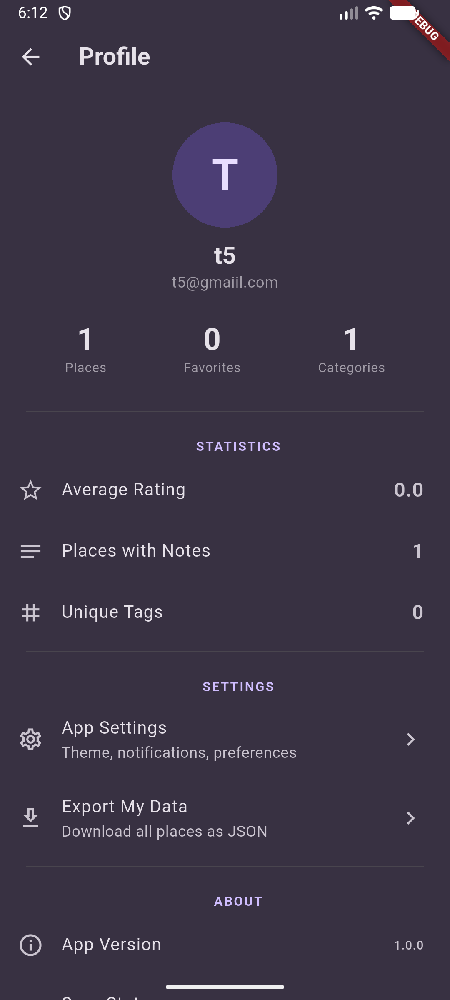
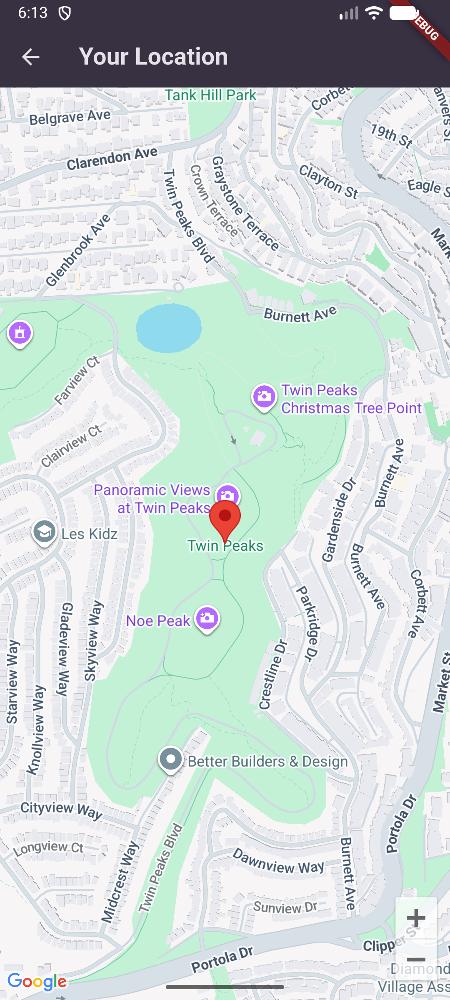

# 🗺️ Favorite Places

A full-stack Flutter mobile application for saving and organizing your favorite locations with AI-powered features using Google Gemini.


---

## 🎮 Try It Live On Appetize

**[🚀 Launch App in Browser →](https://appetize.io/app/b_3ngeiuwtjjg7qmxhieybnpzq4u)**

*No download required! Runs in a simulated Android device via Appetize.io*

> **Note:** "Get current location" feature has limited functionality in the simulator due to GPS constraints. Use "Select on Map" to test location features.

---

## ✨ Features

### 📱 Core Functionality
- **Photo Management** - Upload and store multiple photos per place using Firebase Storage
- **Location Integration** - Interactive Google Maps picker with address geocoding
- **Favorites System** - Mark and filter your favorite places
- **Custom Categories** - Park, Restaurant, Entertainment, Shopping, Travel, and more
- **Rich Notes & Ratings** - Add detailed notes and 5-star ratings for each place
- **Advanced Search** - Filter by category, favorites, and search by name or location

### 🤖 AI-Powered Features
- **Smart Tag Suggestions** - Google Gemini AI analyzes photos and context to suggest relevant tags
- **Intelligent Summaries** - AI-powered note summarization with tips and best times to visit
- **Natural Language Processing** - Smart search across all place data

### 👤 User Experience
- **Secure Authentication** - Email/Password and Google Sign-In via Firebase Auth
- **Real-time Sync** - Cloud Firestore database with instant updates across devices
- **Modern UI/UX** - Material Design 3 with smooth animations and intuitive navigation
- **Dark Mode Support** - Beautiful interface that adapts to system preferences
- **Statistics Dashboard** - Track total places, favorites, and category distribution
- **Profile Management** - Customize your profile and view your travel history

---

## 📸 Screenshots

<div align="center">
  
  
  
  
</div>

<div align="center">
  
  
  
</div>

*Screenshots coming soon - app is live on Appetize!*

---

## 🏗️ Architecture

### Frontend (Mobile App)
- **Framework:** Flutter 3.27+ with Dart 3.6+
- **State Management:** Riverpod for reactive, scalable state
- **Authentication:** Firebase Auth with multi-provider support
- **Database:** Cloud Firestore for real-time data sync
- **Storage:** Firebase Storage for photo uploads
- **Maps:** Google Maps Flutter with geocoding
- **UI:** Material Design 3 with custom theming

### Backend (REST API)
- **Runtime:** Node.js 20 (Alpine Linux)
- **Framework:** Express.js with async/await
- **AI Integration:** Google Gemini 1.5 Flash (1.5M requests/month FREE)
- **Authentication:** Firebase Admin SDK for token verification
- **Deployment:** Google Cloud Run (serverless, auto-scaling)
- **Security:** Helmet, CORS, rate limiting, input validation

### Infrastructure
- **Hosting:** Firebase Hosting with GitHub Actions CI/CD
- **Backend:** Google Cloud Run with auto-deploy from GitHub
- **Secrets:** Google Secret Manager for API keys and credentials
- **APIs:** Google Maps API, Google Gemini AI API
- **Monitoring:** Cloud Run metrics and Firebase Analytics

---

## 🛠️ Tech Stack

| Layer | Technologies |
|-------|-------------|
| **Mobile** | Flutter, Dart, Riverpod, Firebase SDK |
| **Backend** | Node.js, Express, Firebase Admin |
| **AI** | Google Gemini 1.5 Flash |
| **Database** | Cloud Firestore (NoSQL) |
| **Storage** | Firebase Storage |
| **Auth** | Firebase Authentication |
| **Cloud** | Google Cloud Run, Secret Manager |
| **CI/CD** | GitHub Actions |
| **Maps** | Google Maps Platform |
| **Deployment** | Docker, Appetize.io |

---

## 🚀 Getting Started

### Prerequisites
- Flutter 3.27+ ([Install Flutter](https://docs.flutter.dev/get-started/install))
- Node.js 18+ ([Install Node.js](https://nodejs.org/))
- Firebase project ([Create Firebase Project](https://console.firebase.google.com/))
- Google Cloud account ([Google Cloud Console](https://console.cloud.google.com/))
- Google Gemini API key ([Get API Key](https://aistudio.google.com/app/apikey) - FREE)

---

### Backend Setup

1. **Clone the repository**
   ```bash
   git clone https://github.com/Esstar612/FavoritePlaces.git
   cd FavoritePlaces/backend
   ```

2. **Install dependencies**
   ```bash
   npm install
   ```

3. **Configure environment**
   ```bash
   cp .env.example .env
   ```
   
   Edit `.env` and add:
   ```env
   # Google Gemini AI (FREE - https://aistudio.google.com/app/apikey)
   GEMINI_API_KEY=your_gemini_api_key_here
   
   # Firebase Admin SDK
   FIREBASE_SERVICE_ACCOUNT_PATH=./serviceAccountKey.json
   
   # Server Configuration
   PORT=8080
   NODE_ENV=development
   CORS_ORIGIN=*
   ```

4. **Add Firebase Service Account**
   - Go to [Firebase Console](https://console.firebase.google.com/)
   - Project Settings → Service Accounts → Generate New Private Key
   - Save as `serviceAccountKey.json` in backend folder

5. **Run locally**
   ```bash
   npm run dev
   ```
   
   Backend will be running at `http://localhost:8080`

6. **Deploy to Cloud Run**
   ```bash
   # Build and deploy
   gcloud builds submit --tag gcr.io/YOUR-PROJECT-ID/favorite-places-backend
   gcloud run deploy favorite-places-backend \
     --image gcr.io/YOUR-PROJECT-ID/favorite-places-backend \
     --region us-central1 \
     --allow-unauthenticated
   ```

---

### Mobile App Setup

1. **Navigate to mobile directory**
   ```bash
   cd mobile
   ```

2. **Install dependencies**
   ```bash
   flutter pub get
   ```

3. **Configure API keys**
   ```bash
   cp lib/config.example.dart lib/config.dart
   ```
   
   Edit `lib/config.dart`:
   ```dart
   class AppConfig {
     static const String googleMapsApiKey = 'YOUR_GOOGLE_MAPS_API_KEY';
     static const String backendUrl = 'YOUR_CLOUD_RUN_URL';
   }
   ```

4. **Add Firebase configuration**
   
   **For Android:**
   - Download `google-services.json` from Firebase Console
   - Place in `android/app/google-services.json`
   
   **For iOS:**
   - Download `GoogleService-Info.plist` from Firebase Console
   - Place in `ios/Runner/GoogleService-Info.plist`

5. **Set up Google Maps**
   
   **Android** (`android/app/src/main/AndroidManifest.xml`):
   ```xml
   <meta-data
       android:name="com.google.android.geo.API_KEY"
       android:value="YOUR_GOOGLE_MAPS_API_KEY"/>
   ```
   
   **iOS** (`ios/Runner/AppDelegate.swift`):
   ```swift
   GMSServices.provideAPIKey("YOUR_GOOGLE_MAPS_API_KEY")
   ```

6. **Run the app**
   ```bash
   flutter run
   ```

---

## 📦 Project Structure

```
FavoritePlaces/
├── backend/                     # Node.js Express API
│   ├── routes/
│   │   ├── ai.js               # AI endpoints (Gemini)
│   │   └── user.js             # User management
│   ├── server.js               # Main server file
│   ├── package.json            # Dependencies
│   ├── Dockerfile              # Cloud Run deployment
│   └── .env.example            # Environment template
│
├── mobile/                      # Flutter mobile app
│   ├── lib/
│   │   ├── models/             # Data models (Place, User)
│   │   ├── providers/          # Riverpod state management
│   │   ├── screens/            # UI screens
│   │   ├── services/           # API & Firebase services
│   │   ├── widgets/            # Reusable components
│   │   └── main.dart           # App entry point
│   ├── assets/                 # Images, fonts, icons
│   ├── android/                # Android-specific code
│   ├── ios/                    # iOS-specific code
│   └── pubspec.yaml            # Flutter dependencies
│
├── .github/workflows/           # CI/CD pipelines
│   └── deploy-appetize.yml     # Auto-deploy to Appetize
│
├── screenshots/                 # App screenshots
├── README.md                    # This file
└── CONTRIBUTING.md              # Contribution guidelines
```

---

## 🔐 Security Features

- ✅ Firebase ID token verification on all protected endpoints
- ✅ Rate limiting on AI endpoints (100 requests per 15 minutes)
- ✅ CORS configuration for production domains
- ✅ Secrets stored in Google Secret Manager
- ✅ Firestore security rules (user data isolation)
- ✅ HTTPS only (enforced by Cloud Run)
- ✅ Input validation and sanitization
- ✅ Helmet.js security headers
- ✅ No API keys in source code (gitignored)

---

## 💰 Cost Estimate

**Monthly costs for personal use:**

| Service | Free Tier | Estimated Cost |
|---------|-----------|----------------|
| Google Gemini AI | 1.5M requests/month | **$0** |
| Firebase (Auth, Firestore, Storage) | Generous free tier | **$0** |
| Google Maps API | $200 monthly credit | **$0** |
| Cloud Run | 2M requests/month | **$0** |
| **Total** | | **$0/month** 🎉 |

**For 1,000+ users:** ~$10-30/month depending on usage

---

## 📝 API Documentation

### Authentication
All protected endpoints require Firebase ID token:
```
Authorization: Bearer <firebase_id_token>
```

### Endpoints

#### AI Features

**POST** `/ai/summarize-notes`
```json
{
  "notes": "Visited this beautiful park...",
  "placeName": "Central Park"
}
```

**Response:**
```json
{
  "summary": "Beautiful urban park with...",
  "tips": ["Best time: Morning hours", ...]
}
```

**POST** `/ai/suggest-tags`
```json
{
  "placeName": "Golden Gate Park",
  "notes": "Great for picnics",
  "category": "Park"
}
```

**Response:**
```json
{
  "tags": ["outdoor", "scenic", "family-friendly"]
}
```

#### User Management

**GET** `/user/profile`
- Returns user profile information

**GET** `/user/stats`
- Returns user statistics (total places, favorites, etc.)

**GET** `/health`
- Health check endpoint

For complete API documentation, see [Backend README](./backend/README.md)

---

## 🎯 Future Enhancements

- [ ] **Social Features** - Share places with friends and create collaborative lists
- [ ] **Offline Mode** - Local caching for offline access
- [ ] **Trip Planning** - Create multi-day trips with multiple places
- [ ] **Recommendations** - AI-powered place suggestions based on preferences
- [ ] **Import/Export** - Sync with Google Maps and other services
- [ ] **Multi-language Support** - Localization for global users
- [ ] **Photo Editing** - In-app filters and editing tools
- [ ] **Reviews & Ratings** - Public reviews and community ratings
- [ ] **Notifications** - Reminders for favorite places nearby
- [ ] **Web Dashboard** - Desktop interface for managing places

---

## 🧪 Testing

### Run Tests
```bash
# Backend tests
cd backend
npm test

# Flutter tests
cd mobile
flutter test

# Integration tests
flutter test integration_test/
```

### Manual Testing Checklist
- [ ] User signup and login
- [ ] Add place with photo
- [ ] AI tag suggestions
- [ ] AI note summarization
- [ ] Search and filter
- [ ] Mark as favorite
- [ ] Edit and delete places
- [ ] View on map
- [ ] Profile statistics

---

## 📄 License

MIT License - feel free to use this project for learning and portfolio purposes!

---

## 👤 Author

**Star Olaojo**

- 🌐 Portfolio: [esstar612.github.io/my_portfolio](https://esstar612.github.io/my_portfolio/)
- 💼 LinkedIn: [linkedin.com/in/star-olaojo](https://www.linkedin.com/in/star-olaojo/)
- 🐙 GitHub: [@Esstar612](https://github.com/Esstar612)
- 📱 Live Demo: [Appetize.io](https://appetize.io/app/b_3ngeiuwtjjg7qmxhieybnpzq4u)

---

## 🙏 Acknowledgments

- **Google Gemini AI** - For providing free, powerful AI capabilities
- **Firebase** - For comprehensive backend infrastructure
- **Flutter Team** - For the amazing cross-platform framework
- **Google Cloud** - For serverless deployment platform
- **Appetize.io** - For browser-based app testing

---

## 🤝 Contributing

Contributions are welcome! Please read [CONTRIBUTING.md](CONTRIBUTING.md) for details on how to submit pull requests, report issues, and suggest improvements.

---

## 📧 Contact

Have questions or suggestions? Feel free to reach out:

- Open an issue on [GitHub](https://github.com/Esstar612/FavoritePlaces/issues)
- Connect on [LinkedIn](https://www.linkedin.com/in/star-olaojo/)
- Check out my [portfolio](https://esstar612.github.io/my_portfolio/)

---

**Built with ❤️ using Flutter, Firebase, and Google Cloud**

[](https://flutter.dev)
[](https://firebase.google.com)
[](https://cloud.google.com/run)