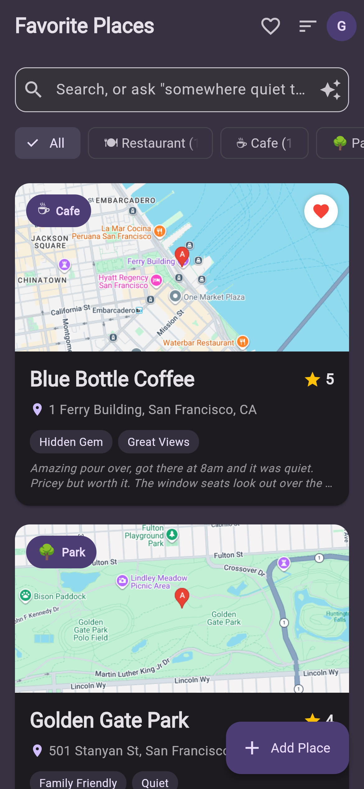
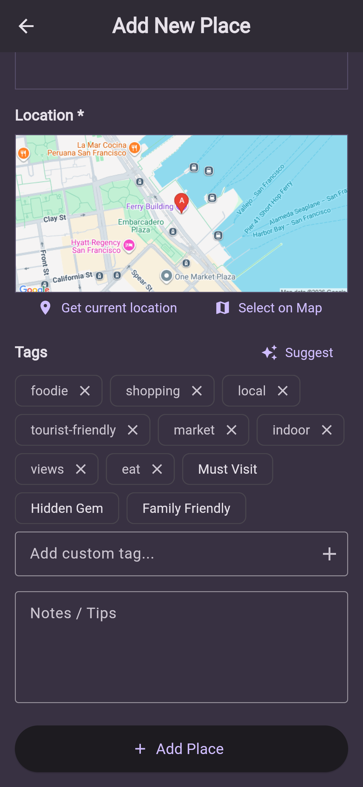
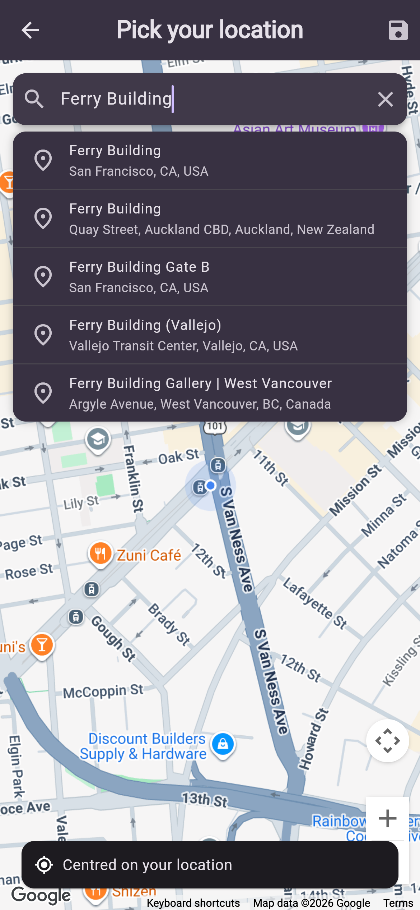
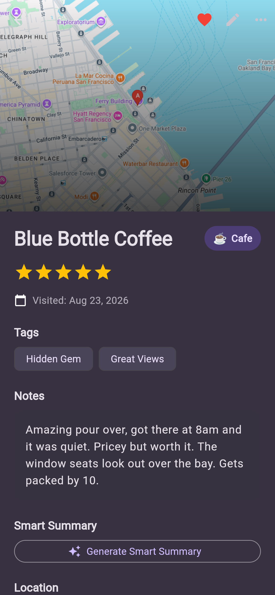
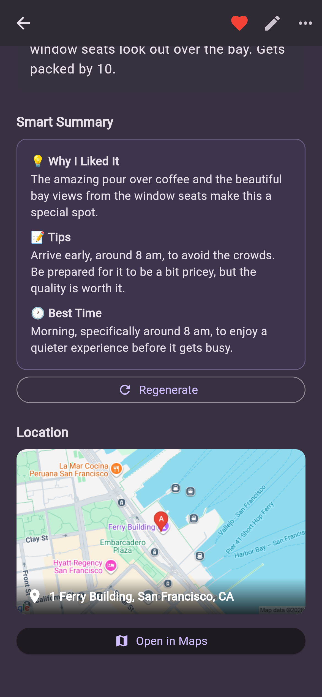
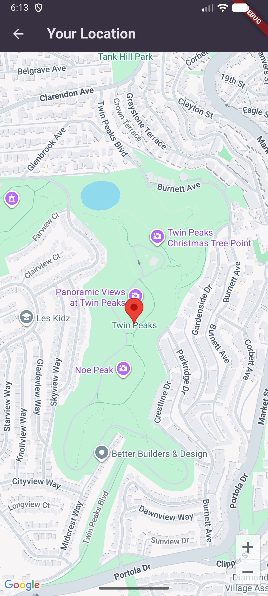

# 🗺️ Favorite Places

A full-stack app for saving and organising the places you actually want to remember — with AI that summarises your notes, suggests tags, and answers questions like *"somewhere quiet to work"*.

Flutter on Android and the web, an Express API on Cloud Run, Firebase for auth/data/storage, and Google Gemini for the AI.


---

## 🎮 Try it live

### **[→ favorite-places-app-94adb.web.app](https://favorite-places-app-94adb.web.app)**

Hit **Continue as guest** — no sign-up, no email. You get your own private sandbox
pre-loaded with five sample places, and nothing you do there is visible to anyone else.

Worth trying once you're in:

| | |
|---|---|
| ✨ **Ask AI** in the search bar | try `art` — plain search matches *T-**art**-ine Bakery*; the AI returns SFMOMA |
| ✨ **Suggest** on the Tags field | generates tags from the place name, or from the photo if there is one |
| **Generate Smart Summary** on a place | turns freeform notes into why you liked it, tips, and best time to go |
| **Add Place → Select on Map** | live place search, and it opens where you are |

There's also an Android build on
**[Appetize](https://appetize.io/app/b_3ngeiuwtjjg7qmxhieybnpzq4u)**, but the web
version is the better demo: Appetize's free tier caps sessions at 3 minutes and
one viewer at a time, and its emulated device can't run the Google Maps SDK, so
"Select on Map" fails there.

---

## ✨ Features

### Core
- **Places with photos, notes, ratings, tags and categories** — stored in Firestore, synced live
- **Map picker with place search** — Google Places autocomplete, opens on your location
- **Photos optional** — a place with no photo shows a map of where it is instead of a grey placeholder
- **Search, filter and sort** — by text, category, favourites, name, rating or date
- **Favourites**, pull-to-refresh, and a stats view

### AI (Google Gemini)
- **Smart Summary** — turns raw notes into *why I liked it / tips / best time to go*, cached so revisiting doesn't re-run the model
- **Tag suggestions** — from the place name and category, plus Cloud Vision image analysis when a photo exists
- **Natural-language search** — "somewhere quiet to work" matches on meaning, not substrings

### Accounts
- **Email/password, Google Sign-In, or guest** — guests get an isolated sandbox that's deleted on sign-out
- **Light and dark themes**, persisted per account
- **Export your data** as JSON, or delete your account and everything in it

---

## 📸 Screenshots

<div align="center">
  
  
  
</div>

<div align="center">
  
  
  
</div>

---

## 🏗️ Architecture

**Mobile & web** — Flutter 3.38 / Dart 3.10, Riverpod for state, Firebase Auth,
Cloud Firestore (live snapshot listeners), Firebase Storage, Google Maps, Material 3.
One codebase ships to Android and the browser.

**Backend** — Node.js 20 on Express, deployed to Cloud Run as a distroless-ish Alpine
container. Verifies Firebase ID tokens on every protected route, rate-limits per IP,
and holds the Gemini and Geocoding keys server-side so clients never see them.

**Infrastructure** — GitHub Actions builds and deploys the web app to Firebase Hosting
and the APK to Appetize on every push to `main`. Firestore and Storage security rules
are versioned in this repo and deployed with the Firebase CLI.

### Why the backend exists

It isn't just an AI proxy. It also holds keys that shouldn't ship to a client:
Gemini, and the Geocoding key — the Geocoding API rejects HTTP-referrer-restricted
keys outright, so a browser can't call it safely without exposing an unrestricted one.

---

## 🛠️ Tech stack

| Layer | Technologies |
|-------|-------------|
| **Client** | Flutter, Dart, Riverpod, Material 3 |
| **Backend** | Node.js, Express, Firebase Admin SDK |
| **AI** | Google Gemini 2.5 Flash Lite, Cloud Vision (optional) |
| **Database** | Cloud Firestore |
| **Storage** | Firebase Storage |
| **Auth** | Firebase Authentication (email, Google, anonymous) |
| **Maps** | Maps SDK for Android, Maps JavaScript, Static Maps, Places API (New), Geocoding |
| **Cloud** | Cloud Run, Firebase Hosting, Secret Manager |
| **CI/CD** | GitHub Actions |

---

## 🚀 Getting started

### Prerequisites

- Flutter 3.38+ · Node.js 20+
- A Firebase project, and a Google Cloud project with the Maps APIs enabled
- A [Gemini API key](https://aistudio.google.com/app/apikey) (free tier)

---

### Backend

```bash
git clone https://github.com/Esstar612/FavoritePlaces.git
cd FavoritePlaces/backend
npm install
cp .env.example .env
```

Fill in `.env` — every variable in the example is one the server actually reads:

```env
GEMINI_API_KEY=...                              # required, all /ai routes
GOOGLE_MAPS_SERVER_KEY=...                      # required, /maps/reverse-geocode
FIREBASE_SERVICE_ACCOUNT_PATH=./serviceAccountKey.json
CORS_ORIGIN=https://your-app.web.app
```

Download a service account key (Firebase Console → Project Settings → Service
Accounts → Generate new private key) and save it as `backend/serviceAccountKey.json`.
Both that file and `.env` are gitignored, and a `.dockerignore` keeps them out of
any image you build.

```bash
npm run dev     # http://localhost:8080
```

Deploy:

```bash
gcloud run deploy favorite-places-backend --source . \
  --region us-central1 --platform managed \
  --update-env-vars GOOGLE_MAPS_SERVER_KEY=...
```

On Cloud Run, pass the service account JSON as `FIREBASE_SERVICE_ACCOUNT_JSON`
(the whole document as one string) instead of a file path.

---

### Mobile & web app

```bash
cd mobile
flutter pub get
cp lib/config.example.dart lib/config.dart
```

Fill in `lib/config.dart` (gitignored). It takes **two** Maps keys, and
`AndroidManifest.xml` takes a third — see [API keys](#-api-keys) below for why.

Add your Firebase config:

- **Android** — `google-services.json` → `android/app/`
- **iOS** — `GoogleService-Info.plist` → `ios/Runner/`
- **Web** — the web config lives in `lib/firebase_options_web.dart`, which is
  committed on purpose: a Firebase web config is public by design and is enforced
  by security rules, not secrecy

Then:

```bash
flutter run              # Android / iOS
flutter run -d chrome    # web
flutter test             # 25 unit tests
```

Deploy the security rules before using it against a real project:

```bash
firebase deploy --only firestore:rules,storage:rules,firestore:indexes
```

---

## 🔑 API keys

A Google API key can only carry **one** application restriction, and this app calls
Maps from four different places with different identities. So it uses four keys,
each scoped to one job:

| Key | Restriction | Lives in |
|-----|-------------|----------|
| **Android** | package name + SHA-1, Maps SDK only | `AndroidManifest.xml` — committed, and safe to: it's useless without the signing certificate |
| **Web** | HTTP referrer → your hosting domain | `config.dart` (gitignored) |
| **Mobile REST** | API-restricted only | `config.dart` (gitignored) |
| **Server** | Geocoding only | backend env var — never ships to a client |

The mobile REST key is the one that can't be locked to an application: REST calls
from a phone carry no package identity or referrer for a key to be restricted
against. It's limited by API, and worth a quota cap.

---

## 📦 Project structure

```
FavoritePlaces/
├── backend/
│   ├── routes/
│   │   ├── ai.js                  # Gemini: summaries, tags, smart search
│   │   ├── maps.js                # reverse geocoding proxy
│   │   └── user.js                # profile, settings, stats, export, demo seed
│   ├── server.js                  # auth middleware, rate limiting, CORS
│   ├── Dockerfile
│   ├── .dockerignore              # keeps .env + service account out of images
│   └── .env.example
│
├── mobile/
│   ├── lib/
│   │   ├── models/                # Place, PlaceSummary, categories
│   │   ├── providers/             # Riverpod: auth, places, settings
│   │   ├── screens/               # auth, list, detail, add/edit, map, profile
│   │   ├── services/              # backend client, Firestore, Places search
│   │   ├── utils/                 # display helpers, static maps, web bootstrap
│   │   └── config.example.dart    # copy to config.dart
│   └── test/                      # unit tests
│
├── .github/workflows/
│   ├── firebase-hosting-merge.yml # build + deploy web on push to main
│   └── deploy-appetize.yml        # build + upload APK on push to main
│
├── firestore.rules                # per-user data isolation
├── storage.rules                  # per-user photo isolation
└── firestore.indexes.json         # composite index for the places query
```

---

## 🔐 Security

- Firebase ID token verified on every `/ai`, `/user` and `/maps` route
- Firestore and Storage rules scope every document and file to its owner — including
  on create, so a place can't be written under someone else's ID
- Rate limiting per IP, with `trust proxy` set so Cloud Run's load balancer doesn't
  collapse every caller into one bucket
- Gemini and Geocoding keys live server-side only
- Client keys are restricted per surface (see [API keys](#-api-keys))
- Secrets kept out of the repo and out of Docker images
- Helmet security headers, CORS allowlist, input validation and payload caps

---

## 💰 Running costs

Everything sits inside free tiers at portfolio scale:

| Service | Free allowance |
|---------|----------------|
| Gemini 2.5 Flash Lite | generous free tier |
| Firebase Auth / Firestore / Storage / Hosting | Spark plan |
| Maps Platform | 10,000 free calls per SKU per month |
| Cloud Run | 2M requests/month |

Two things to know. Maps Platform replaced its old flat $200 credit with **per-SKU
free tiers in March 2025** — plenty here, but not the same model. And Cloud Run and
Firebase Storage need billing *enabled* even to use the free tier; if billing lapses,
Auth and Firestore keep working while everything else returns 503, which is a
confusing failure to debug.

---

## 📝 API

All routes except `/` and `/health` require:

```
Authorization: Bearer <firebase_id_token>
```

### AI

| Endpoint | Body | Returns |
|---|---|---|
| `POST /ai/summarize-notes` | `title`, `notes`, `category`, `address` | `whyILikedIt`, `tips`, `bestTimeToGo` |
| `POST /ai/suggest-tags` | `title`, `category`, optional `photoUrl` | `tags[]` |
| `POST /ai/smart-search` | `query`, `places[]` | `matchingIds[]`, `explanation` |

`photoUrl` is optional — a place being created hasn't uploaded its photo yet, so
Gemini falls back to the title and category. Cloud Vision runs only when a URL is
supplied.

### User

| Endpoint | Purpose |
|---|---|
| `GET/PUT /user/profile` | profile document |
| `GET/PUT /user/settings` | theme, notifications, preferences |
| `GET /user/stats` | counts, averages, tag totals |
| `POST /user/export` | full data export as JSON |
| `POST /user/seed-demo` | populate a new guest account (idempotent) |
| `DELETE /user/account` | delete the account and all its data |

### Maps

| Endpoint | Purpose |
|---|---|
| `GET /maps/reverse-geocode?lat=&lng=` | coordinates → address |

Full details in the [backend README](./backend/README.md).

---

## 🧪 Testing

```bash
cd mobile && flutter test      # 25 unit tests
cd mobile && flutter analyze   # clean
```

Tests cover `Place.fromFirestore` (defaults, unknown categories, unparseable dates,
integer latitudes), `PlaceSummary.matches` (the check that invalidates a cached AI
summary when notes change), and the display helpers that once crashed the profile
screen on an empty display name. Both CI workflows run them before building.

The backend has no automated tests yet — the endpoints are exercised manually and
through the app.

---

## 🎯 Possible next steps

- [ ] A map view showing every saved place at once
- [ ] Multiple photos per place (the data model already stores a list; the UI takes one)
- [ ] Sharing places or lists with other people
- [ ] Offline support
- [ ] Trip planning across several places
- [ ] Backend test suite

---

## 📄 License

MIT — use it for learning or portfolio purposes.

---

## 👤 Author

**Star Olaojo**

- 🌐 Portfolio: [esstar612.github.io/my_portfolio](https://esstar612.github.io/my_portfolio/)
- 💼 LinkedIn: [linkedin.com/in/star-olaojo](https://www.linkedin.com/in/star-olaojo/)
- 🐙 GitHub: [@Esstar612](https://github.com/Esstar612)
- 🎮 Live demo: [favorite-places-app-94adb.web.app](https://favorite-places-app-94adb.web.app)

---

## 🙏 Acknowledgments

Google Gemini, Firebase, Flutter, Google Cloud, and Appetize.io.

---

## 🤝 Contributing

See [CONTRIBUTING.md](CONTRIBUTING.md).

---

**Built with Flutter, Firebase, and Google Cloud**
