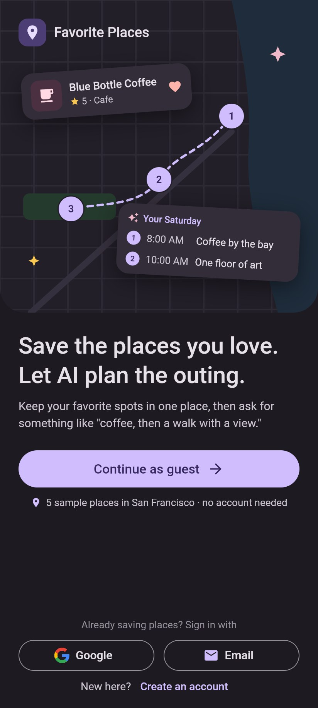
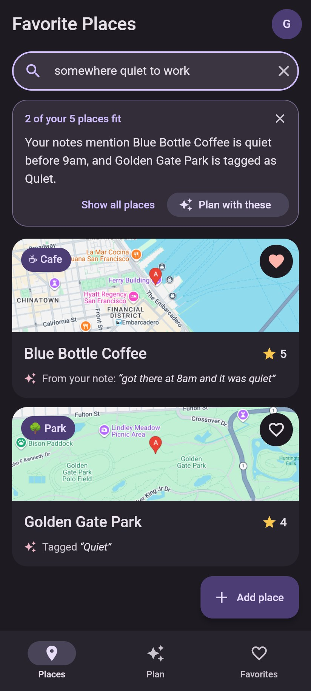
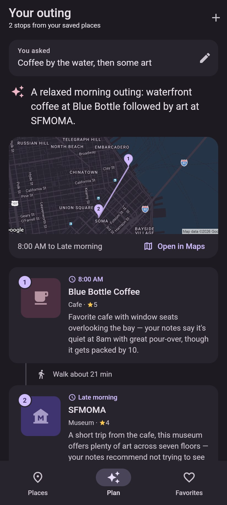
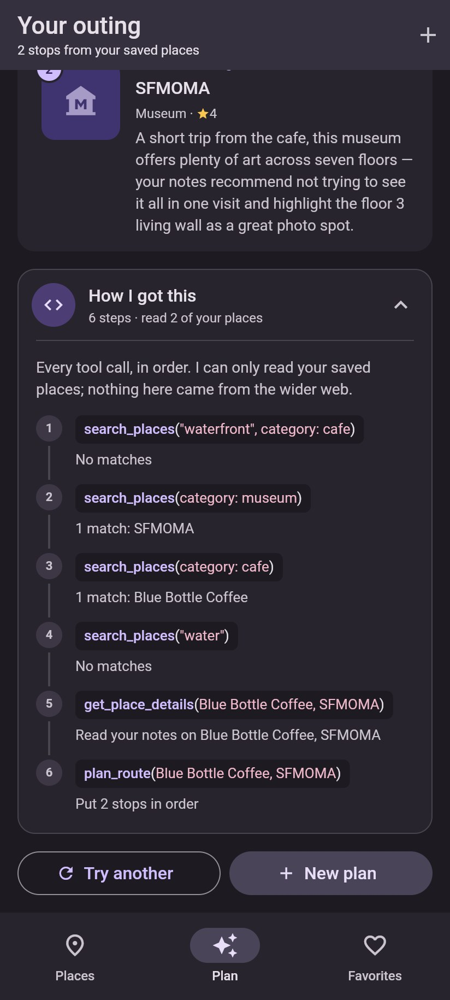
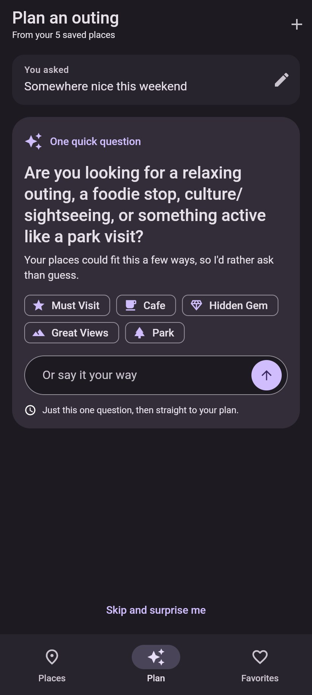
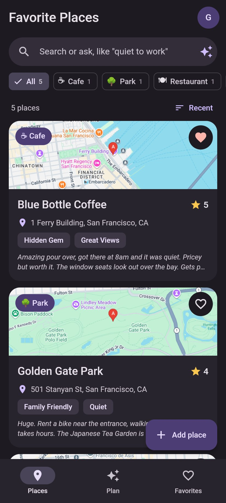
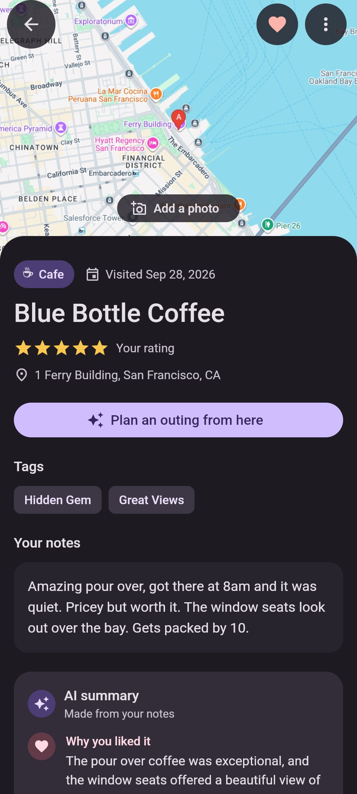
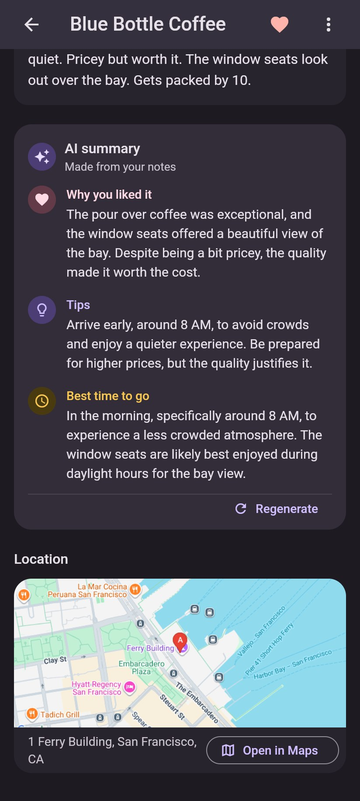

# Favorite Places

Save the places you love, then ask an agent to plan an outing from them.

A Flutter app for Android and the web, an Express backend for Gemini features,
and a Python outing agent on FastAPI and LangGraph that runs on Claude or GPT
behind one provider interface. Every agent deploy waits on an eval suite in
LangSmith that scores tool use and answers on both providers.


**Case study:** [portfolio-three-rose-44.vercel.app/projects/favorite-places](https://portfolio-three-rose-44.vercel.app/projects/favorite-places)

---

## Try it

### [favorite-places-app-94adb.web.app](https://favorite-places-app-94adb.web.app)

Tap **Continue as guest**. No sign-up or email: you get a private sandbox with
five sample places in San Francisco, and nothing you do there is visible to
anyone else. You can turn the guest into a real account later from your
profile, and anything you added is kept.

Worth trying:

| Where | Try |
|---|---|
| **Plan** tab | "Coffee by the water, then some art". The agent picks from your places, orders the stops, and estimates the walk. Open **How I got this** to see every tool call it made. |
| **Plan** tab | "Somewhere nice this weekend". Too vague to answer, so it asks one clarifying question. |
| Search bar | Type to filter, or press Enter to ask, like "somewhere quiet to work". Each match shows the note or tag that made it fit. |
| A place | **Summarize my notes** turns freeform notes into why you liked it, tips, and the best time to go. |
| **Add place** | Search Google Places or drop a pin on the map. It warns you when you've already saved something there. |

On a desktop browser the app renders inside a phone frame. There's also an
Android build on
[Appetize](https://appetize.io/app/b_3ngeiuwtjjg7qmxhieybnpzq4u), but its
free tier caps sessions at 3 minutes and its emulator can't run the Google
Maps SDK, so the web app is the better demo.

---

## Screenshots

<div align="center">
  
  
  
  
</div>

<div align="center">
  
  
  
  
</div>

---

## Features

### Outing agent
- **Plans from your own places only.** Three tools search your places, read
  their notes, and order the stops. The uid comes only from your verified
  Firebase ID token and never reaches the model or the tools' arguments.
- **Grounded answers.** Every recommended place is checked against what the
  tools actually returned for you. Anything else is dropped and logged.
- **Asks when it should.** Each answer carries a confidence. Below a threshold
  calibrated per provider on eval data, it asks one clarifying question
  instead of guessing.
- **Shows its work.** The app lists every tool call and what it found.
- **Claude or GPT** behind one provider interface, set per deployment.

### App
- Places with photos, notes, ratings, tags and categories, synced live
  through Firestore
- Map-first Add Place: Google Places search with a preview photo and its
  attribution, dropped pins with reverse geocoding, and a duplicate check
  within 60 m
- Search that filters as you type and asks Gemini on Enter
- AI summaries of your notes, and tag suggestions
- Favorites, sorting, stats, km or miles, and light, dark or system theme
- Email, Google or guest sign-in; guests can upgrade without losing places
- Export your data as JSON, or delete your account and everything in it

---

## Architecture

```
Flutter app (Android + web)
   │  Firebase ID token on every call
   ├── Firebase: Auth, Firestore, Storage (owner-scoped rules in this repo)
   ├── backend/  Express on Cloud Run: Gemini on Vertex AI, geocoding, user data
   └── agent/    FastAPI + LangGraph on Cloud Run: Claude or GPT, read-only Firestore
```

- **`mobile/`**: Flutter 3.47 and Dart 3.12, Riverpod, Material 3, Google
  Maps and Places.
- **`backend/`**: Node.js 20 and Express on Cloud Run. Gemini through Vertex
  AI with Application Default Credentials, on its own service account. Verifies
  the ID token on every `/ai`, `/user` and `/maps` route, rate-limits per IP,
  and keeps the Geocoding key server-side.
- **`agent/`**: Python, FastAPI and LangGraph on Cloud Run, at most one
  instance. Reads places with a read-only service account. Rate limits per
  user and globally. See [`agent/README.md`](agent/README.md), and
  [`agent/BUILD_LOG.md`](agent/BUILD_LOG.md) for how it was built and
  measured.

### How the agent answers

1. Verify the ID token and bind the uid to the run.
2. The model loops over `search_places`, `get_place_details` and `plan_route`.
3. A structured-output step returns the stops, a reason for each, and a
   confidence.
4. Below the provider's threshold: return one clarifying question and no places.
5. If the draft recommends a place the model never read, or an itinerary with
   no route, a fallback step reads and routes it, then finalizes once more.
6. Check every place against what the tools returned, and log one JSON line
   with the tool calls and place IDs (never notes or the uid).

---

## CI and deploys

| Workflow | Runs on | What it does |
|---|---|---|
| `agent-ci.yml` | PRs and pushes to `main` that change `agent/` | pytest, a container check, then on `main` the full eval suite on both providers and a Cloud Run deploy |
| `mobile-ci.yml` | PRs that change `mobile/` | analyze, tests, a web build and an APK build |
| `firebase-hosting-merge.yml` | pushes to `main` that change `mobile/` | analyze, tests, then deploy the web app to Firebase Hosting |
| `deploy-appetize.yml` | pushes to `main` that change `mobile/` | tests, then build the APK and upload it to Appetize |
| `codeql.yml` | PRs, pushes and a schedule | code scanning |

- **The eval gate:** 32 cases x 3 repetitions x 2 providers = 192 agent runs
  in LangSmith. `grounded` and `no_forbidden` must be 1.0, and every other
  scorer must clear its provider's threshold, or nothing deploys.
- **No service account keys.** GitHub Actions signs in to Google Cloud
  through Workload Identity Federation, limited to this repository and the
  `main` branch.
- The mobile workflows all read the Flutter version from `mobile/.fvmrc`.
- The backend is deployed by hand with `gcloud run deploy` (see below).

---

## Getting started

### Prerequisites
- Flutter 3.47 or newer, Node.js 20, Python 3.11 or newer
- A Firebase project, and a Google Cloud project with the Maps APIs and
  Vertex AI enabled

### Backend

```bash
cd backend
npm install
cp .env.example .env
```

Fill in `.env`:

```env
GOOGLE_CLOUD_PROJECT=your-project-id
GOOGLE_MAPS_SERVER_KEY=...
CORS_ORIGIN=http://localhost:5050
```

There are no key files. Gemini (through Vertex AI) and Firebase Admin both use
Application Default Credentials:

```bash
gcloud auth application-default login
gcloud auth application-default set-quota-project your-project-id
npm run dev     # http://localhost:8080
```

Deploy (the service account and its roles are described in
[`backend/README.md`](backend/README.md)):

```bash
gcloud run deploy favorite-places-backend --source . --region us-central1 --service-account places-backend-runtime@your-project-id.iam.gserviceaccount.com --update-env-vars GOOGLE_CLOUD_PROJECT=your-project-id,GOOGLE_CLOUD_LOCATION=us-central1,GOOGLE_MAPS_SERVER_KEY=...
```

### Agent

See [`agent/README.md`](agent/README.md) for setup, the smoke run, evals and
deploys. Tests and fixture-store evals need no Firebase credentials.

### App

```bash
cd mobile
flutter pub get
cp lib/config.example.dart lib/config.dart
```

Fill in `lib/config.dart` (gitignored) with the backend and agent URLs and two
Maps keys; `AndroidManifest.xml` takes a third (see [API keys](#api-keys)).
Add `google-services.json` to `android/app/` for Android. The web Firebase
config lives in `lib/firebase_options_web.dart` and is committed on purpose: a
Firebase web config is public by design, and access is enforced by security
rules.

```bash
flutter run -d chrome
flutter test
```

Deploy the security rules before using a real project:

```bash
firebase deploy --only firestore:rules,storage:rules,firestore:indexes
```

---

## API keys

A Google API key carries only one application restriction, and the app calls
Maps from four surfaces with different identities, so it uses four keys:

| Key | Restriction | Lives in |
|---|---|---|
| **Android** | package name and SHA-1, Maps SDK only | `AndroidManifest.xml`, committed, useless without the signing certificate |
| **Web** | HTTP referrer, the hosting domain | `config.dart` (gitignored) |
| **Mobile REST** | API-restricted only | `config.dart` (gitignored) |
| **Server** | Geocoding only | backend environment, never ships to a client |

REST calls from a phone carry no package identity or referrer, so the mobile
REST key can only be limited by API and a quota cap.

---

## Security

- The Firebase ID token is verified on every backend and agent route.
- Firestore and Storage rules scope every document and file to its owner,
  including on create.
- The agent reads Firestore with admin credentials, so it enforces ownership
  itself: the uid comes only from the verified token, and every place it
  returns is checked against that user's data.
- Production agent runs aren't traced to LangSmith, because they read real
  users' notes. Logs carry place IDs, never notes or the uid.
- No long-lived Google Cloud keys: deploys use Workload Identity Federation,
  and each service has its own service account.
- Rate limits on the backend (per IP) and the agent (per user and global), and
  a billing budget alert.

---

## Testing

```bash
cd mobile && flutter test     # 131 tests
cd agent && pytest            # 263 tests
```

The counts are from the latest runs. The backend has no automated tests yet;
its endpoints are checked by hand with `curl` after each deploy.

---

## Project structure

```
FavoritePlaces/
├── agent/             Python outing agent: FastAPI, LangGraph, evals
├── backend/           Express API: Gemini, geocoding, user data
├── mobile/            Flutter app for Android and the web
├── screenshots/
├── .github/workflows/
├── firestore.rules
├── storage.rules
├── firestore.indexes.json
└── storage.cors.json
```

---

## License

MIT.

## Author

**Star Olaojo**
[Portfolio](https://portfolio-three-rose-44.vercel.app) ·
[LinkedIn](https://www.linkedin.com/in/star-olaojo/) ·
[GitHub](https://github.com/Esstar612)

See [CONTRIBUTING.md](CONTRIBUTING.md) to contribute.
